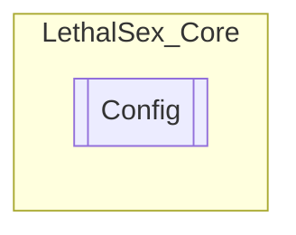

# Config `Internal class`

## Diagram


## Members
### Properties
#### Internal Static properties
| Type | Name | Methods |
| --- | --- | --- |
| `bool` | [`ToggleDebugConsole`](#toggledebugconsole) | `get, private set` |
| `bool` | [`ToggleDevMenu`](#toggledevmenu) | `get, private set` |

### Methods
#### Internal  methods
| Returns | Name |
| --- | --- |
| `void` | [`Init`](#init)() |

## Details
### Constructors
#### Config
```csharp
public Config()
```

### Methods
#### Init
```csharp
internal void Init()
```

### Properties
#### ToggleDebugConsole
```csharp
internal static bool ToggleDebugConsole { get; private set; }
```

#### ToggleDevMenu
```csharp
internal static bool ToggleDevMenu { get; private set; }
```

*Generated with* [*ModularDoc*](https://github.com/hailstorm75/ModularDoc)
