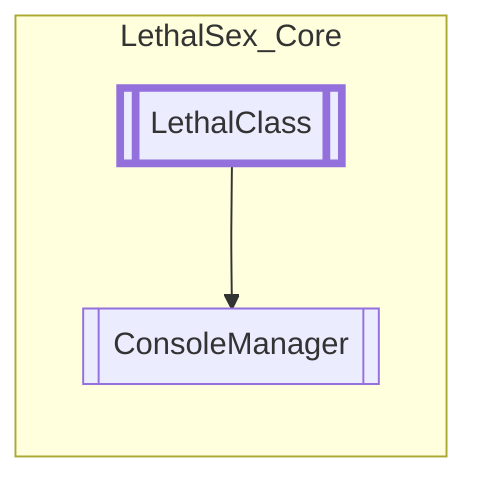

# ConsoleManager `Public class`

## Diagram


## Members
### Properties
#### Public Static properties
| Type | Name | Methods |
| --- | --- | --- |
| `GameObject` | [`ConsoleObject`](#consoleobject) | `get, set` |
| `ScrollRect` | [`ConsoleScroll`](#consolescroll) | `get, set` |
| `TextMeshProUGUI` | [`ConsoleText`](#consoletext) | `get, set` |
| [`ConsoleManager`](lethalsex_core-ConsoleManager) | [`Module`](#module) | `get, private set` |

### Methods
#### Protected  methods
| Returns | Name |
| --- | --- |
| `void` | [`OnHUDAwake`](#onhudawake)()<br>Load console object if not already loaded into scene |

#### Public Static methods
| Returns | Name |
| --- | --- |
| `void` | [`Log`](#log-14)(`...`)<br>Log information |

## Details
### Inheritance
 - [
`LethalClass`
](./lethalsex_core-LethalClass)

### Constructors
#### ConsoleManager
```csharp
public ConsoleManager()
```

### Methods
#### OnHUDAwake
```csharp
protected override void OnHUDAwake()
```
##### Summary
Load console object if not already loaded into scene

#### Log [1/4]
```csharp
public static void Log(object msg)
```
##### Arguments
| Type | Name | Description |
| --- | --- | --- |
| `object` | msg |  |

##### Summary
Log information

#### Log [2/4]
```csharp
public static void Log(object msg, Color color)
```
##### Arguments
| Type | Name | Description |
| --- | --- | --- |
| `object` | msg |  |
| `Color` | color |  |

##### Summary
Log information

#### Log [3/4]
```csharp
public static void Log(object msg, object prefix)
```
##### Arguments
| Type | Name | Description |
| --- | --- | --- |
| `object` | msg |  |
| `object` | prefix |  |

##### Summary
Log information

#### Log [4/4]
```csharp
public static void Log(object msg, object prefix, Color color)
```
##### Arguments
| Type | Name | Description |
| --- | --- | --- |
| `object` | msg |  |
| `object` | prefix |  |
| `Color` | color |  |

##### Summary
Log information

### Properties
#### Module
```csharp
public static ConsoleManager Module { get; private set; }
```

#### ConsoleText
```csharp
public static TextMeshProUGUI ConsoleText { get; set; }
```

#### ConsoleObject
```csharp
public static GameObject ConsoleObject { get; set; }
```

#### ConsoleScroll
```csharp
public static ScrollRect ConsoleScroll { get; set; }
```

*Generated with* [*ModularDoc*](https://github.com/hailstorm75/ModularDoc)
