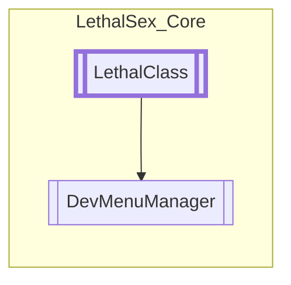

# DevMenuManager `Public class`

## Diagram


## Members
### Properties
#### Public Static properties
| Type | Name | Methods |
| --- | --- | --- |
| [`DevMenuManager`](lethalsex_core-DevMenuManager) | [`Module`](#module) | `get, private set` |

### Methods
#### Protected  methods
| Returns | Name |
| --- | --- |
| `void` | [`OnHUDAwake`](#onhudawake)() |

#### Public Static methods
| Returns | Name |
| --- | --- |
| `void` | [`SetAction`](#setaction-12)(`...`) |

## Details
### Inheritance
 - [
`LethalClass`
](./lethalsex_core-LethalClass)

### Nested types
#### Classes
 - `DMSection`
 - `DMButton`
 - `DMSlider`

### Constructors
#### DevMenuManager
```csharp
public DevMenuManager()
```

### Methods
#### OnHUDAwake
```csharp
protected override void OnHUDAwake()
```

#### SetAction [1/2]
```csharp
public static void SetAction(Button btn, Action action)
```
##### Arguments
| Type | Name | Description |
| --- | --- | --- |
| `Button` | btn |   |
| `Action` | action |   |

#### SetAction [2/2]
```csharp
public static void SetAction(Slider slider, Action<float> action, Transform PercentLabel)
```
##### Arguments
| Type | Name | Description |
| --- | --- | --- |
| `Slider` | slider |   |
| `Action`&lt;`float`&gt; | action |   |
| `Transform` | PercentLabel |   |

### Properties
#### Module
```csharp
public static DevMenuManager Module { get; private set; }
```

*Generated with* [*ModularDoc*](https://github.com/hailstorm75/ModularDoc)
