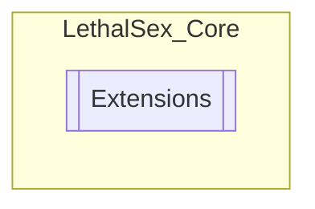

# Extensions `Public class`

## Description
Just some helpful tools

## Diagram


## Members
### Methods
#### Public Static methods
| Returns | Name |
| --- | --- |
| `JObject` | [`CreateEntry`](#createentry-13)(`...`) |
| `string` | [`GetObjPath`](#getobjpath)(`Transform` transform)<br>Get object path of gameObject. |
| `T` | [`GetOrAddComponent`](#getoraddcomponent)(`GameObject` gameObject, `bool` Log) |
| `void` | [`InsertArray`](#insertarray)(`object``[]` items, `JObject` dest, `string` key) |
| `void` | [`InsertList`](#insertlist)(`object``[]` values, `string``[]` keys, `JObject` dest, `string` key) |
| `JObject` | [`JsonPackage`](#jsonpackage)(`JObject``[]` objects, `string``[]` keys) |
| `void` | [`SmoothIncrementValue`](#smoothincrementvalue)(`string` ActionName, `Action`&lt;`float`&gt; action, `float` start, `float` target, `float` duration) |
| `bool` | [`TryDestroy`](#trydestroy-13)(`...`)<br>Try and destroy gameObject |

## Details
### Summary
Just some helpful tools

### Methods
#### GetOrAddComponent
```csharp
public static T GetOrAddComponent<T>(GameObject gameObject, bool Log)
where T : Component
```
##### Arguments
| Type | Name | Description |
| --- | --- | --- |
| `GameObject` | gameObject |   |
| `bool` | Log |   |

#### TryDestroy [1/3]
```csharp
public static bool TryDestroy(GameObject o)
```
##### Arguments
| Type | Name | Description |
| --- | --- | --- |
| `GameObject` | o |  |

##### Summary
Try and destroy gameObject

##### Returns
True if it destroyed gameObject or not

#### TryDestroy [2/3]
```csharp
public static bool TryDestroy(Transform o)
```
##### Arguments
| Type | Name | Description |
| --- | --- | --- |
| `Transform` | o |  |

##### Summary
Try and destroy gameObject

##### Returns
True if it destroyed gameObject or not

#### TryDestroy [3/3]
```csharp
public static bool TryDestroy(Component o)
```
##### Arguments
| Type | Name | Description |
| --- | --- | --- |
| `Component` | o |  |

##### Summary
Try and destroy component

##### Returns
True if it destroyed component or not

#### GetObjPath
```csharp
public static string GetObjPath(Transform transform)
```
##### Arguments
| Type | Name | Description |
| --- | --- | --- |
| `Transform` | transform |  |

##### Summary
Get object path of gameObject.

##### Returns
Path to gameObject

#### SmoothIncrementValue
```csharp
public static async void SmoothIncrementValue(string ActionName, Action<float> action, float start, float target, float duration)
```
##### Arguments
| Type | Name | Description |
| --- | --- | --- |
| `string` | ActionName |   |
| `Action`&lt;`float`&gt; | action |   |
| `float` | start |   |
| `float` | target |   |
| `float` | duration |   |

#### JsonPackage
```csharp
public static JObject JsonPackage(JObject[] objects, string[] keys)
```
##### Arguments
| Type | Name | Description |
| --- | --- | --- |
| `JObject``[]` | objects |   |
| `string``[]` | keys |   |

#### InsertArray
```csharp
public static void InsertArray(object[] items, JObject dest, string key)
```
##### Arguments
| Type | Name | Description |
| --- | --- | --- |
| `object``[]` | items |   |
| `JObject` | dest |   |
| `string` | key |   |

#### InsertList
```csharp
public static void InsertList(object[] values, string[] keys, JObject dest, string key)
```
##### Arguments
| Type | Name | Description |
| --- | --- | --- |
| `object``[]` | values |   |
| `string``[]` | keys |   |
| `JObject` | dest |   |
| `string` | key |   |

#### CreateEntry [1/3]
```csharp
public static JObject CreateEntry(Action<JObject> entry)
```
##### Arguments
| Type | Name | Description |
| --- | --- | --- |
| `Action`&lt;`JObject`&gt; | entry |   |

#### CreateEntry [2/3]
```csharp
public static JObject CreateEntry(Action<JObject> entry, string key)
```
##### Arguments
| Type | Name | Description |
| --- | --- | --- |
| `Action`&lt;`JObject`&gt; | entry |   |
| `string` | key |   |

#### CreateEntry [3/3]
```csharp
public static JObject CreateEntry(Action<JObject> entry, JObject dest, string key)
```
##### Arguments
| Type | Name | Description |
| --- | --- | --- |
| `Action`&lt;`JObject`&gt; | entry |   |
| `JObject` | dest |   |
| `string` | key |   |

*Generated with* [*ModularDoc*](https://github.com/hailstorm75/ModularDoc)
