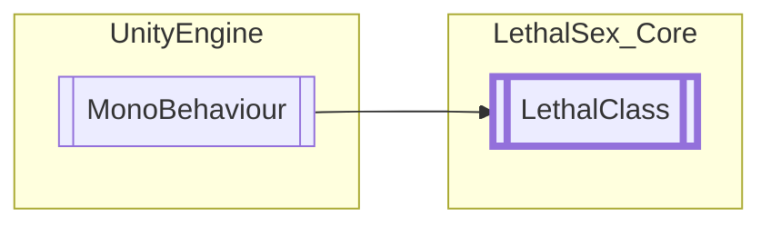

# LethalClass `Public class`

## Diagram


## Members
### Properties
#### Public  properties
| Type | Name | Methods |
| --- | --- | --- |
| `bool` | [`Registered`](#registered) | `get` |

### Methods
#### Internal Static methods
| Returns | Name |
| --- | --- |
| `void` | [`RegisterAll`](#registerall)() |

#### Protected  methods
| Returns | Name |
| --- | --- |
| `void` | [`Destroy`](#destroy)() |
| `void` | [`Disable`](#disable)() |
| `void` | [`Enable`](#enable)() |
| `void` | [`OnGrabObject`](#ongrabobject)(`GrabbableObject` obj) |
| `void` | [`OnHUDAwake`](#onhudawake)() |
| `void` | [`OnHUDStart`](#onhudstart)() |
| `void` | [`OnHUDUpdate`](#onhudupdate)() |
| `void` | [`OnLobbyAwake`](#onlobbyawake)() |
| `void` | [`OnLobbyStart`](#onlobbystart)() |
| `void` | [`OnLocalPlayerStart`](#onlocalplayerstart)(`PlayerControllerB` _LocalPlayer) |
| `void` | [`OnPlayerDie`](#onplayerdie)() |
| `void` | [`OnRegister`](#onregister)() |
| `void` | [`OnShipLand`](#onshipland)() |
| `void` | [`Unregister`](#unregister)() |

## Details
### Inheritance
 - `MonoBehaviour`

### Constructors
#### LethalClass
```csharp
protected LethalClass()
```

### Methods
#### RegisterAll
```csharp
internal static void RegisterAll()
```

#### Unregister
```csharp
protected void Unregister()
```

#### Enable
```csharp
protected virtual void Enable()
```

#### Disable
```csharp
protected virtual void Disable()
```

#### Destroy
```csharp
protected virtual void Destroy()
```

#### OnRegister
```csharp
protected virtual void OnRegister()
```

#### OnHUDStart
```csharp
protected virtual void OnHUDStart()
```

#### OnHUDAwake
```csharp
protected virtual void OnHUDAwake()
```

#### OnHUDUpdate
```csharp
protected virtual void OnHUDUpdate()
```

#### OnLobbyStart
```csharp
protected virtual void OnLobbyStart()
```

#### OnLobbyAwake
```csharp
protected virtual void OnLobbyAwake()
```

#### OnLocalPlayerStart
```csharp
protected virtual void OnLocalPlayerStart(PlayerControllerB _LocalPlayer)
```
##### Arguments
| Type | Name | Description |
| --- | --- | --- |
| `PlayerControllerB` | _LocalPlayer |   |

#### OnGrabObject
```csharp
protected virtual void OnGrabObject(GrabbableObject obj)
```
##### Arguments
| Type | Name | Description |
| --- | --- | --- |
| `GrabbableObject` | obj |   |

#### OnShipLand
```csharp
protected virtual void OnShipLand()
```

#### OnPlayerDie
```csharp
protected virtual void OnPlayerDie()
```

### Properties
#### Registered
```csharp
public bool Registered { get; }
```

*Generated with* [*ModularDoc*](https://github.com/hailstorm75/ModularDoc)
