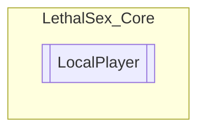

# LocalPlayer `Public class`

## Description
Easier way for me to get shit from the player ¯\_(ツ)_/¯

## Diagram


## Members
### Properties
#### Public Static properties
| Type | Name | Methods |
| --- | --- | --- |
| `Camera` | [`Camera`](#camera) | `get` |
| `float` | [`Insanity`](#insanity) | `get, set` |
| `bool` | [`IsMenuOpen`](#ismenuopen) | `get` |
| `bool` | [`IsNearOtherPlayers`](#isnearotherplayers) | `get` |
| `bool` | [`IsTermOpen`](#istermopen) | `get` |
| `float` | [`MaxInsanity`](#maxinsanity) | `get, set` |
| `GameObject` | [`Player`](#player) | `get` |
| `PlayerControllerB` | [`PlayerController`](#playercontroller) | `get` |

### Methods
#### Public Static methods
| Returns | Name |
| --- | --- |
| `Task`&lt;`Camera`&gt; | [`CameraAsync`](#cameraasync)(`int` maxIter, `int` delay) |
| `Task`&lt;`float`&gt; | [`InsanityAsync`](#insanityasync)(`int` maxIter, `int` delay) |
| `Task`&lt;`float`&gt; | [`MaxInsanityAsync`](#maxinsanityasync)(`int` maxIter, `int` delay) |
| `Task`&lt;`GameObject`&gt; | [`PlayerAsync`](#playerasync)(`int` maxIter, `int` delay) |
| `Task`&lt;`PlayerControllerB`&gt; | [`PlayerControllerAsync`](#playercontrollerasync)(`int` maxIter, `int` delay) |
| `PlayerControllerB``[]` | [`PlayersNearMe`](#playersnearme)(`float` rad) |

## Details
### Summary
Easier way for me to get shit from the player ¯\_(ツ)_/¯

### Methods
#### PlayerControllerAsync
```csharp
public static async Task<PlayerControllerB> PlayerControllerAsync(int maxIter, int delay)
```
##### Arguments
| Type | Name | Description |
| --- | --- | --- |
| `int` | maxIter |   |
| `int` | delay |   |

#### PlayerAsync
```csharp
public static async Task<GameObject> PlayerAsync(int maxIter, int delay)
```
##### Arguments
| Type | Name | Description |
| --- | --- | --- |
| `int` | maxIter |   |
| `int` | delay |   |

#### InsanityAsync
```csharp
public static async Task<float> InsanityAsync(int maxIter, int delay)
```
##### Arguments
| Type | Name | Description |
| --- | --- | --- |
| `int` | maxIter |   |
| `int` | delay |   |

#### MaxInsanityAsync
```csharp
public static async Task<float> MaxInsanityAsync(int maxIter, int delay)
```
##### Arguments
| Type | Name | Description |
| --- | --- | --- |
| `int` | maxIter |   |
| `int` | delay |   |

#### CameraAsync
```csharp
public static async Task<Camera> CameraAsync(int maxIter, int delay)
```
##### Arguments
| Type | Name | Description |
| --- | --- | --- |
| `int` | maxIter |   |
| `int` | delay |   |

#### PlayersNearMe
```csharp
public static PlayerControllerB PlayersNearMe(float rad)
```
##### Arguments
| Type | Name | Description |
| --- | --- | --- |
| `float` | rad |   |

### Properties
#### PlayerController
```csharp
public static PlayerControllerB PlayerController { get; }
```

#### Player
```csharp
public static GameObject Player { get; }
```

#### Insanity
```csharp
public static float Insanity { get; set; }
```

#### MaxInsanity
```csharp
public static float MaxInsanity { get; set; }
```

#### Camera
```csharp
public static Camera Camera { get; }
```

#### IsNearOtherPlayers
```csharp
public static bool IsNearOtherPlayers { get; }
```

#### IsMenuOpen
```csharp
public static bool IsMenuOpen { get; }
```

#### IsTermOpen
```csharp
public static bool IsTermOpen { get; }
```

*Generated with* [*ModularDoc*](https://github.com/hailstorm75/ModularDoc)
