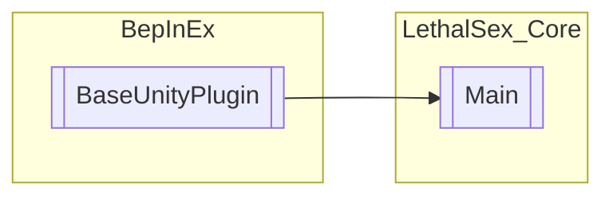

# Main `Public class`

## Diagram


## Members
### Properties
#### Public Static properties
| Type | Name | Methods |
| --- | --- | --- |
| [`Main`](lethalsex_core-Main) | [`Instance`](#instance) | `get, private set` |
| `AssetBundle` | [`bundle`](#bundle) | `get, set` |
| `ManualLogSource` | [`mls`](#mls) | `get, set` |

## Details
### Inheritance
 - `BaseUnityPlugin`

### Constructors
#### Main
```csharp
public Main()
```

### Properties
#### Instance
```csharp
public static Main Instance { get; private set; }
```

#### bundle
```csharp
public static AssetBundle bundle { get; set; }
```

#### mls
```csharp
public static ManualLogSource mls { get; set; }
```

*Generated with* [*ModularDoc*](https://github.com/hailstorm75/ModularDoc)
