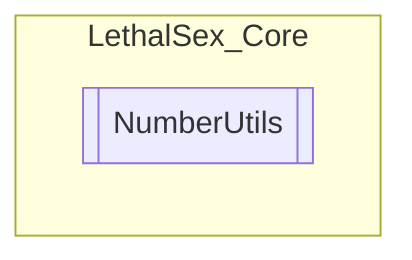

# NumberUtils `Public class`

## Description
This class was used for my Obfuscation project but I started to prefer it more than the original shit.

## Diagram


## Members
### Methods
#### Public Static methods
| Returns | Name |
| --- | --- |
| `bool` | [`Chance`](#chance)(`int` percentage)<br>Return ueaj |
| `long` | [`GenInt64`](#genint64)()<br>Generate and returns a random Int64 value |
| `int` | [`GenerateTrulyRandomNumber`](#generatetrulyrandomnumber)()<br>Generates a truly random number |
| `int` | [`Next`](#next-14)(`...`)<br>Returns a number from 0 to max |
| `double` | [`NextDouble`](#nextdouble)()<br>Generate and returns a random double value |
| `int` | [`NextL`](#nextl-12)(`...`)<br>Returns a number from 0 to (max - 1) |

## Details
### Summary
This class was used for my Obfuscation project but I started to prefer it more than the original shit.

### Methods
#### GenerateTrulyRandomNumber
```csharp
public static int GenerateTrulyRandomNumber()
```
##### Summary
Generates a truly random number

##### Returns


#### Chance
```csharp
public static bool Chance(int percentage)
```
##### Arguments
| Type | Name | Description |
| --- | --- | --- |
| `int` | percentage |  |

##### Summary
Return ueaj

##### Returns


#### GenInt64
```csharp
public static long GenInt64()
```
##### Summary
Generate and returns a random Int64 value

##### Returns


#### Next [1/4]
```csharp
public static int Next(int max)
```
##### Arguments
| Type | Name | Description |
| --- | --- | --- |
| `int` | max |  |

##### Summary
Returns a number from 0 to max

##### Returns


#### Next [2/4]
```csharp
public static int Next(int min, int max)
```
##### Arguments
| Type | Name | Description |
| --- | --- | --- |
| `int` | min |  |
| `int` | max |  |

##### Summary
Returns a number from min to max

##### Returns


#### Next [3/4]
```csharp
public static float Next(float max)
```
##### Arguments
| Type | Name | Description |
| --- | --- | --- |
| `float` | max |  |

##### Summary
Returns a number from 0 to max

##### Returns


#### Next [4/4]
```csharp
public static float Next(float min, float max)
```
##### Arguments
| Type | Name | Description |
| --- | --- | --- |
| `float` | min |  |
| `float` | max |  |

##### Summary
Returns a number from min to max

##### Returns


#### NextL [1/2]
```csharp
public static int NextL(int max)
```
##### Arguments
| Type | Name | Description |
| --- | --- | --- |
| `int` | max |  |

##### Summary
Returns a number from 0 to (max - 1)

##### Returns


#### NextL [2/2]
```csharp
public static int NextL(int min, int max)
```
##### Arguments
| Type | Name | Description |
| --- | --- | --- |
| `int` | min |  |
| `int` | max |  |

##### Summary
Returns a number from min to (max - 1)

##### Returns


#### NextDouble
```csharp
public static double NextDouble()
```
##### Summary
Generate and returns a random double value

##### Returns


*Generated with* [*ModularDoc*](https://github.com/hailstorm75/ModularDoc)
