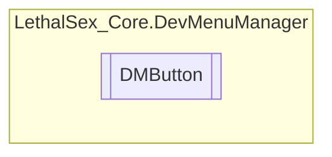

# DMButton `Public class`

## Diagram


## Members
### Properties
#### Protected Static properties
| Type | Name | Methods |
| --- | --- | --- |
| `GameObject` | [`_Button`](#button) | `get, private set` |
| `GameObject` | [`_Label`](#label) | `get, private set` |

#### Public  properties
| Type | Name | Methods |
| --- | --- | --- |
| `GameObject` | [`Button`](#button) | `get` |
| `GameObject` | [`Label`](#label) | `get` |

### Methods
#### Public  methods
| Returns | Name |
| --- | --- |
| `void` | [`DisableLabel`](#disablelabel)() |
| `void` | [`SetLabel`](#setlabel)(`object` str) |

## Details
### Constructors
#### DMButton
```csharp
public DMButton(DMSection section, Action action, object ButtonName)
```
##### Arguments
| Type | Name | Description |
| --- | --- | --- |
| `DMSection` | section |   |
| `Action` | action |   |
| `object` | ButtonName |   |

### Methods
#### DisableLabel
```csharp
public void DisableLabel()
```

#### SetLabel
```csharp
public void SetLabel(object str)
```
##### Arguments
| Type | Name | Description |
| --- | --- | --- |
| `object` | str |   |

### Properties
#### _Button
```csharp
protected static GameObject _Button { get; private set; }
```

#### _Label
```csharp
protected static GameObject _Label { get; private set; }
```

#### Button
```csharp
public GameObject Button { get; }
```

#### Label
```csharp
public GameObject Label { get; }
```

*Generated with* [*ModularDoc*](https://github.com/hailstorm75/ModularDoc)
