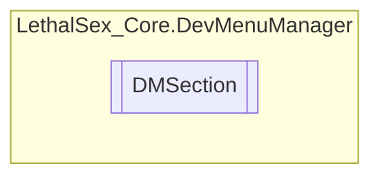

# DMSection `Public class`

## Diagram


## Members
### Properties
#### Protected  properties
| Type | Name | Methods |
| --- | --- | --- |
| `GameObject` | [`BottonSect`](#bottonsect) | `get, private set` |
| `GameObject` | [`Info`](#info) | `get, private set` |
| `GameObject` | [`Name`](#name) | `get, private set` |
| `GameObject` | [`Section`](#section) | `get, private set` |
| `GameObject` | [`TopSect`](#topsect) | `get, private set` |

#### Public  properties
| Type | Name | Methods |
| --- | --- | --- |
| `GameObject` | [`bottonsect`](#bottonsect) | `get` |
| `GameObject` | [`gameObject`](#gameobject) | `get` |
| `GameObject` | [`info`](#info) | `get` |
| `GameObject` | [`name`](#name) | `get` |
| `GameObject` | [`topsect`](#topsect) | `get` |

## Details
### Constructors
#### DMSection
```csharp
public DMSection(object SectionName)
```
##### Arguments
| Type | Name | Description |
| --- | --- | --- |
| `object` | SectionName |   |

### Properties
#### Section
```csharp
protected GameObject Section { get; private set; }
```

#### Name
```csharp
protected GameObject Name { get; private set; }
```

#### Info
```csharp
protected GameObject Info { get; private set; }
```

#### TopSect
```csharp
protected GameObject TopSect { get; private set; }
```

#### BottonSect
```csharp
protected GameObject BottonSect { get; private set; }
```

#### gameObject
```csharp
public GameObject gameObject { get; }
```

#### name
```csharp
public GameObject name { get; }
```

#### info
```csharp
public GameObject info { get; }
```

#### topsect
```csharp
public GameObject topsect { get; }
```

#### bottonsect
```csharp
public GameObject bottonsect { get; }
```

*Generated with* [*ModularDoc*](https://github.com/hailstorm75/ModularDoc)
