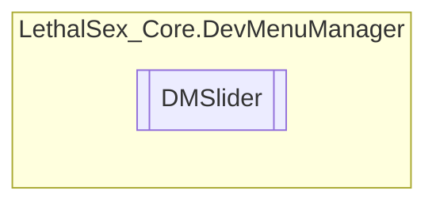

# DMSlider `Public class`

## Diagram


## Members
### Properties
#### Protected  properties
| Type | Name | Methods |
| --- | --- | --- |
| `GameObject` | [`slider`](#slider) | `get, private set` |
| `Slider` | [`slider_comp`](#slidercomp) | `get, private set` |

#### Protected Static properties
| Type | Name | Methods |
| --- | --- | --- |
| `TextMeshProUGUI` | [`Label`](#label) | `get, private set` |

## Details
### Constructors
#### DMSlider
```csharp
public DMSlider(DMSection section, Action<float> action, float min, float max, bool whole, object SliderName, float defaultValue)
```
##### Arguments
| Type | Name | Description |
| --- | --- | --- |
| `DMSection` | section |   |
| `Action`&lt;`float`&gt; | action |   |
| `float` | min |   |
| `float` | max |   |
| `bool` | whole |   |
| `object` | SliderName |   |
| `float` | defaultValue |   |

### Properties
#### slider
```csharp
protected GameObject slider { get; private set; }
```

#### slider_comp
```csharp
protected Slider slider_comp { get; private set; }
```

#### Label
```csharp
protected static TextMeshProUGUI Label { get; private set; }
```

*Generated with* [*ModularDoc*](https://github.com/hailstorm75/ModularDoc)
